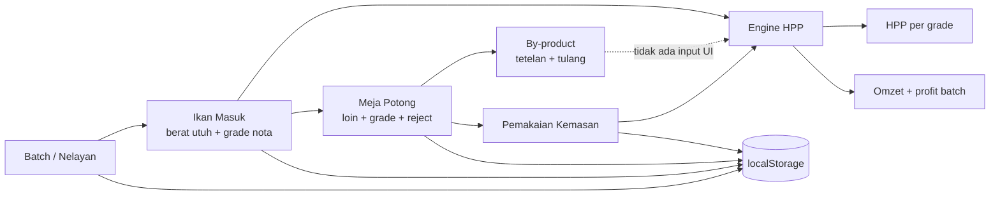

# Audit Menyeluruh KTG Tuna Operations

**Tanggal audit:** 22 Agustus 2026  
**Cakupan:** logika bisnis, akuntansi/HPP, integritas data, keamanan akses HPP, build/dependensi, aksesibilitas, performa, theming, dan arsitektur mobile-first.  
**Keputusan rilis:** **NO-GO untuk dipakai sebagai sumber angka akuntansi produksi tanpa rekonsiliasi manual.** Aplikasi masih layak sebagai prototipe operasional lapangan.

## Implementation Integrity Verdict

**FAIL untuk production release.** Implementasi jelas product-specific dan alur `ikan masuk → meja potong → kemasan → HPP` koheren, tetapi beberapa angka yang ditampilkan sebagai angka final tidak berasal dari satu cost pool yang konsisten. Temuan paling penting adalah:

1. total laba batch dapat cocok dengan workbook, tetapi kartu HPP per grade tidak selalu dapat direkonsiliasi kembali ke biaya aktual;
2. berat `Reject` ikut dihitung sebagai “loin bersih” dan menaikkan rendemen;
3. by-product ada di engine tetapi tidak mempunyai jalur input di UI;
4. UI benar-benar menerima dan menyimpan berat loin negatif;
5. data finansial dan password seluruhnya disimpan di browser tanpa kontrol integritas atau audit trail.

Detector mekanis Impeccable tidak menemukan pola visual terlarang (`[]`). Ini positif untuk konsistensi implementasi visual, tetapi tidak meniadakan bug state, akuntansi, dan aksesibilitas yang terverifikasi melalui pengujian runtime.

## Executive Summary

- **Audit Health Score UI:** **10/20 — Acceptable, significant work needed**.
- **Total temuan:** **24** — P0: 0, P1: 14, P2: 8, P3: 2.
- **Hasil terbaik:** total profit batch referensi berhasil direproduksi tepat **Rp12.512.481**; TypeScript lolos; build produksi berhasil; tidak ada overflow horizontal pada viewport 320–1440 px.
- **Risiko tertinggi:** salah menetapkan harga minimum per grade, rendemen terlalu tinggi karena Reject, laba diberi label lebih tinggi daripada substansi akuntansinya, input negatif, dan tidak adanya jejak perubahan.
- **Kesimpulan:** jangan menjadikan kartu HPP Grade A/B/C sebagai dasar quotation final sebelum kebijakan alokasi biaya diperjelas dan invariant rekonsiliasi diterapkan.

## Audit Health Score

| # | Dimension | Score | Key Finding |
|---|---|---:|---|
| 1 | Accessibility | 2/4 | Modal tidak memindahkan/menahan fokus; 10 input di modal kemasan tidak mempunyai accessible label |
| 2 | Performance | 2/4 | Bundle JS produksi 551.940 byte; `xlsx` dimuat sejak awal dan font dimuat dua kali |
| 3 | Responsive Design | 3/4 | Mobile-first dan bebas overflow 320–1440 px; beberapa target hanya 36–42 px dan header sangat padat pada 320 px |
| 4 | Theming | 2/4 | Tailwind palette konsisten, tetapi belum ada semantic design tokens dan hanya ada dark theme |
| 5 | Implementation Integrity | 1/4 | Product-specific, tetapi terdapat beberapa kegagalan state dan rekonsiliasi finansial yang berulang |
| **Total** |  | **10/20** | **Acceptable — significant work needed** |

## Ruang Lingkup dan Metode

### Artefak yang diperiksa

- 11 file runtime pada `src/`;
- `package.json`, `bun.lock`, konfigurasi TypeScript, Vite, Tailwind, dan HTML;
- `Operasional_Tuna_B2B.xlsx` sebagai baseline akuntansi/HPP;
- `Yield_Ikan_Tuna_Per_Loin_50_Per_Tabel(1).xlsx` sebagai baseline rendemen per ikan;
- `refactor.cjs` dan `refactor.py` sebagai artefak development, bukan runtime.

### Pemeriksaan yang dijalankan

| Pemeriksaan | Hasil |
|---|---|
| TypeScript `tsc --noEmit` | PASS |
| Build produksi `bun run build` | PASS |
| Output build | JS 551.940 B; CSS 32.630 B |
| Impeccable detector | PASS, tidak ada finding mekanis (`[]`) |
| `bun audit --production` | FAIL, 2 vulnerability severity tinggi pada `xlsx` |
| Rekonstruksi batch workbook | Total omzet Rp70.549.650 dan profit Rp12.512.481 cocok |
| Uji viewport riil melalui Chrome DevTools | Tidak ada overflow horizontal pada 320, 360, 375, 390, 768, dan 1440 px |
| Uji runtime Tahap 2 | Menemukan initial-state kosong, grade baru tidak konsisten, dan bobot negatif tersimpan |
| Uji runtime modal | Fokus tetap di belakang modal; Tab bergerak di belakang modal; Escape tidak menutup modal |

## Peta Alur dan Titik Kritis



Titik rawan utamanya adalah engine menghasilkan dua pandangan yang tidak menggunakan dasar alokasi identik: profit batch memakai biaya pembelian aktual, sedangkan HPP grade memakai tarif beli grade output dibagi rendemen rata-rata batch.

## Validasi Perhitungan Akuntansi/HPP

### 1. Rekonstruksi workbook referensi

Data pada `Operasional_Tuna_B2B.xlsx`, sheet `Master_Log_Batch`, baris batch pertama:

| Komponen | Nilai |
|---|---:|
| Ikan utuh masuk | 861,00 kg |
| Pembelian ikan + armada | Rp39.030.000 |
| Loin jadi | 527,88 kg |
| Rendemen | 61,31% |
| Kemasan/operasional | Rp2.642.889 |
| Kargo | Rp31.000/kg |
| Omzet | Rp70.549.650 |
| Gross profit | Rp12.512.481 |
| Gross margin | 17,7% |
| Blended landed COGS | Rp109.944/kg |

Engine aplikasi mereproduksi **omzet Rp70.549.650** dan **profit Rp12.512.481** secara tepat. Artinya, rumus agregat berikut benar untuk baseline tersebut:

```text
profit batch
= revenue loin + revenue by-product
- pembelian ikan
- armada
- kemasan
- kargo
```

### 2. Rekonsiliasi HPP per grade gagal

Pada data yang sama, aplikasi menghasilkan HPP landed sekitar:

| Grade | HPP aplikasi |
|---|---:|
| A | Rp118.128/kg |
| B | Rp111.603/kg |
| C | Rp106.710/kg |

Ketika bagian modal+armada pada kartu grade dikalikan kembali dengan kg output B/C, hasilnya berbeda **Rp643.037** dari modal+armada aktual. Penyebabnya adalah `rawCostA/B/C` dibangun dari **harga beli grade output** dibagi **rendemen batch**, sementara modal aktual dibangun dari **berat ikan yang benar-benar dibeli per grade**.

Skenario ekstrem membuktikan masalahnya: 100 kg ikan Grade C dibeli Rp43.000/kg lalu menghasilkan 60 kg loin Grade A. Modal aktual adalah Rp4.300.000, tetapi kartu Grade A merekonstruksi Rp5.000.000—selisih **Rp700.000**.

### 3. Kebijakan akuntansi yang perlu diputuskan

Produksi loin adalah proses joint-product/by-product. [IAS 2](https://www.ifrs.org/content/dam/ifrs/publications/pdf-standards/english/2021/issued/part-a/ias-2-inventories.pdf) mensyaratkan alokasi biaya konversi joint products secara rasional dan konsisten; salah satu basis yang dapat digunakan adalah relative sales value ketika produk mulai teridentifikasi terpisah.

Pilih satu kebijakan eksplisit:

1. **Blended process costing:** seluruh saleable loin memakai HPP landed rata-rata yang sama; margin berbeda karena harga jual Grade A/B/C berbeda.
2. **Trace-and-allocate:** biaya tiap ikan ditelusuri ke loin yang dihasilkannya, lalu joint cost dialokasikan dengan metode terdokumentasi—misalnya berat atau relative sales value/NRV.

Jangan memakai harga pembelian Grade A untuk output Grade A yang sebenarnya berasal dari ikan Grade C; itu mengubah harga pasar input menjadi biaya historis yang tidak pernah terjadi.

### 4. Invariant yang wajib ada

```text
saleableKg = loinA + loinB + loinC
saleableKg tidak memasukkan Reject

costPool = pembelian aktual + armada + kemasan + kargo - revenue by-product

sum(HPP_teralokasi_per_grade × kg_per_grade)
≈ costPool

profit = revenue loin + revenue by-product
       - pembelian aktual - armada - kemasan - kargo
```

Selisih hanya boleh berasal dari pembulatan yang didefinisikan, bukan dari perbedaan basis grade.

## Detailed Findings by Severity

### P1 — Major

#### F-01 — HPP per grade tidak tie out ke biaya aktual

- **Location:** `src/utils/calculations.ts:42-58`, `61-77`, `142-156`.
- **Category:** Accounting / Business Logic.
- **Impact:** quotation, BEP, dan margin Grade A/B/C dapat salah meskipun total profit batch terlihat benar.
- **Standard:** prinsip rekonsiliasi cost pool; IAS 2 joint-product allocation.
- **Recommendation:** tetapkan blended costing atau trace-and-allocate; tambahkan invariant rekonsiliasi dan golden test workbook.
- **Suggested command:** perbaikan engine accounting terlebih dahulu; lanjutkan `/impeccable clarify` untuk menjelaskan basis HPP pada UI.

#### F-02 — Reject dihitung sebagai “loin bersih” dan menaikkan rendemen

- **Location:** `src/utils/calculations.ts:61-82`, `106-140`; `src/components/Step2MejaPotong.tsx:141-162`.
- **Category:** Accounting / Business Logic.
- **Impact:** 50 kg saleable + 10 kg Reject dari 100 kg dilaporkan sebagai 60% rendemen, padahal saleable yield hanya 50%; jumlah box dan kargo juga dapat ikut salah.
- **Recommendation:** pisahkan `grossCutOutputKg`, `saleableLoinKg`, `rejectKg`, dan `byProductKg`; gunakan saleable loin untuk KPI dan denominator HPP.
- **Suggested command:** engineering fix, lalu `/impeccable clarify` untuk label gross output versus saleable output.

#### F-03 — By-product tidak memiliki jalur input UI

- **Location:** state ada di `src/components/Step3HitungHpp.tsx:64-65,140-151`, tetapi setter tidak pernah dipakai; `kreditByProductPerKgLoin` di `src/types/index.ts:78` juga tidak dipakai.
- **Category:** Accounting / Business Flow.
- **Impact:** aplikasi praktis selalu menganggap revenue by-product Rp0. Workbook simulator justru memakai Rp6.000.000 atau sekitar Rp11.240/kg, sehingga HPP aplikasi dapat terlalu tinggi dan profit terlalu rendah.
- **Recommendation:** tambahkan data batch untuk berat/harga tetelan, tulang, kepala, dan limbah; simpan provenance dan tanggal realisasi.
- **Suggested command:** `/impeccable shape` untuk alur input, kemudian engineering implementation.

#### F-04 — “Laba Bersih” sebenarnya gross/contribution profit

- **Location:** `src/utils/calculations.ts:168-181`; label di `src/components/Step3HitungHpp.tsx:453-469` dan export baris `197`.
- **Category:** Accounting / UX Copy.
- **Impact:** pengguna dapat menganggap tenaga kerja, listrik, sewa, susut persediaan, pajak, fee pembayaran, dan overhead lain sudah dikurangkan, padahal tidak.
- **Standard:** workbook sendiri menyebut hasil tersebut `True_Gross_Profit_Batch`.
- **Recommendation:** ubah menjadi “Laba Kotor Batch” atau “Margin Kontribusi”; gunakan “laba bersih” hanya jika seluruh beban relevan masuk.
- **Suggested command:** `/impeccable clarify`.

#### F-05 — Input negatif dan hasil potong di atas berat utuh dapat disimpan

- **Location:** `src/components/Step2MejaPotong.tsx:76-78,118-129,577-586`; input biaya pada Step 1 dan modal kemasan juga tidak mempunyai batas minimum.
- **Category:** Business Logic / Data Integrity.
- **Impact:** pengujian runtime menyimpan loin `[-5, 65, 0, 0, 0]` sebagai status `done`; rendemen >100% juga tidak ditolak.
- **Recommendation:** validasi domain terpusat: semua angka finite dan nonnegatif; `saleable + reject + by-product <= beratUtuh + toleransi`; tampilkan error per field.
- **Suggested command:** `/impeccable harden` setelah schema validation dibuat.

#### F-06 — Ikan pertama terlihat expanded tetapi tidak memiliki input loin

- **Location:** `src/components/Step2MejaPotong.tsx:40-46,49-71,357-362,478-626`.
- **Category:** Business Flow / State Management.
- **Impact:** pada pembukaan pertama Tahap 2, accordion berstatus terbuka namun 0 input tampil; setelah collapse–reopen baru 4 input muncul. Pengguna dapat menambah satu loin dan menyimpan struktur yang tidak dimaksudkan.
- **Recommendation:** inisialisasi `localLoins` ketika `expandedFishId` awal ditentukan atau jangan buka accordion sebelum state edit siap.
- **Suggested command:** `/impeccable harden`.

#### F-07 — Loin baru kembali ke grade nota setelah regrade

- **Location:** `src/components/Step2MejaPotong.tsx:107-114,631-637`.
- **Category:** Business Logic / State Consistency.
- **Impact:** pengujian runtime: ikan Grade C diregrade A; Loin 1–4 menjadi A, tetapi Loin 5 baru menjadi C.
- **Recommendation:** gunakan `fish.gradePotong || fish.gradeNota` sebagai default saat menambah loin.
- **Suggested command:** `/impeccable harden`.

#### F-08 — Batch default membawa pemakaian 21 box walaupun data masih kosong

- **Location:** `src/context/AppContext.tsx:57-76`; fallback pemakaian di `src/utils/calculations.ts:105-112`.
- **Category:** Accounting / Defaults.
- **Impact:** batch awal memakai seed workbook—10 es, 21 box, 15,75 lusin jelly, dan seterusnya—meskipun volume aktual berbeda. HPP akan memakai nilai tersebut sampai pengguna menekan autofill atau mengubahnya.
- **Recommendation:** default quantity harus `undefined/0`; seed demo dipisahkan dari data produksi dan diberi badge “contoh”.
- **Suggested command:** `/impeccable clarify` dan `/impeccable harden`.

#### F-09 — Batch ID dan nomor ikan dapat duplikat

- **Location:** `src/components/SimpleNavbar.tsx:25-42`; `src/components/Step1IkanMasuk.tsx:33-34,69-72`; `src/context/AppContext.tsx:173-175`.
- **Category:** Data Integrity / Business Logic.
- **Impact:** Batch ID bebas diedit tanpa uniqueness check. Setelah ikan dihapus, `length + 1` dapat menggunakan ulang nomor ikan yang masih ada, merusak traceability.
- **Recommendation:** gunakan UUID internal immutable; kode display harus unique per batch; nomor berikutnya adalah `max(noIkan)+1`, bukan panjang array.
- **Suggested command:** `/impeccable harden`.

#### F-10 — LocalStorage bukan ledger dan tidak memiliki audit trail

- **Location:** `src/context/AppContext.tsx:82-162,173-229`.
- **Category:** Architecture / Accounting Controls.
- **Impact:** data hanya berada pada satu browser, mudah diubah/hapus, tidak atomic, tidak memiliki actor/timestamp/history, dan berisiko hilang saat cache dibersihkan.
- **Recommendation:** abstraksikan repository; gunakan backend/database dengan transaksi, revision history, backup, export/import terverifikasi, dan optimistic concurrency.
- **Suggested command:** engineering architecture; `/impeccable harden` hanya untuk recovery/error UX.

#### F-11 — Password HPP hanya penghalang visual di client

- **Location:** `src/context/AppContext.tsx:117-141`; `src/components/Step3HitungHpp.tsx:94-128`.
- **Category:** Security / Authorization.
- **Impact:** password plaintext ada di `localStorage`, default `ktg123` dibocorkan pada pesan error, status unlock ada di `sessionStorage`, dan seluruh data modal/HPP tetap dapat dibaca melalui DevTools.
- **Recommendation:** jika data rahasia, lakukan autentikasi/otorisasi server-side dan jangan kirim data HPP kepada user tanpa hak; hapus default credential dari UI.
- **Suggested command:** `/impeccable harden` untuk UX, tetapi kontrol keamanan wajib di backend.

#### F-12 — Modal tidak benar-benar modal dan 10 input kemasan tidak berlabel

- **Location:** modal di `BatchPackagingModal.tsx:210-245`, `SimpleNavbar.tsx:193-296`, `Step1IkanMasuk.tsx:161-283`, dan `Step3HitungHpp.tsx:755-824`.
- **Category:** Accessibility.
- **Impact:** saat modal kemasan dibuka, fokus tetap pada input di belakang modal; satu Tab bergerak ke tombol grade di belakang modal; Escape tidak menutup modal; 10 input tidak mempunyai label programatik.
- **Standard:** [WAI-ARIA Modal Dialog Pattern](https://www.w3.org/WAI/ARIA/apg/patterns/dialog-modal/) mengharuskan fokus masuk ke dialog, Tab tetap di dalam, Escape menutup, dan fokus kembali ke pemicu.
- **Recommendation:** gunakan native `<dialog>` atau focus-trap teruji, set initial focus, inert-kan background, restore focus, dan hubungkan seluruh label dengan `for/id`.
- **Suggested command:** `/impeccable harden`.

#### F-13 — Tidak ada automated test untuk engine akuntansi

- **Location:** `package.json` hanya memiliki `dev`, `build`, dan `preview`.
- **Category:** Quality Assurance / Accounting.
- **Impact:** regresi formula, grade transformation, Reject, zero value, dan pembulatan tidak akan terdeteksi sebelum angka dipakai.
- **Recommendation:** tambahkan unit test table-driven, property/invariant test, golden test workbook, dan CI gate.
- **Suggested command:** engineering test suite; re-run `/impeccable audit` untuk UI setelahnya.

#### F-14 — Tanggal batch memakai UTC, bukan zona Asia/Jakarta

- **Location:** `src/context/AppContext.tsx:60`; `src/components/SimpleNavbar.tsx:23,31,115`.
- **Category:** Business Logic / Localization.
- **Impact:** `new Date().toISOString().slice(0,10)` dapat menghasilkan tanggal hari sebelumnya antara 00:00–06:59 WIB.
- **Recommendation:** format tanggal kalender memakai zona bisnis eksplisit `Asia/Jakarta`, bukan potongan ISO UTC.
- **Suggested command:** `/impeccable harden`.

### P2 — Minor / Significant Follow-up

#### F-15 — Nilai nol diam-diam diganti default

- **Location:** `src/utils/calculations.ts:42-44,98-99,115-121,139,159-161`.
- **Category:** Accounting / Edge Cases.
- **Impact:** harga beli/jual atau kargo Rp0 tidak dapat direpresentasikan karena operator `||`; uji runtime menghasilkan kargo Rp31.000 dan harga jual default walaupun data batch bernilai 0.
- **Recommendation:** gunakan `??` dan validasi kebijakan nol secara eksplisit.
- **Suggested command:** `/impeccable harden`.

#### F-16 — Scope “Semua Ikan Masuk” mencampur WIP dengan hasil aktual

- **Location:** `src/components/Step3HitungHpp.tsx:56-57,131-168,407-431`.
- **Category:** Accounting / UX.
- **Impact:** ikan pending menambah biaya dan berat input tanpa output loin, sehingga HPP tampak melonjak; label laporan masih menyebut angka real aktual.
- **Recommendation:** pisahkan laporan completed batch dari WIP forecast dan beri status completeness gate.
- **Suggested command:** `/impeccable clarify`.

#### F-17 — JSON batch dan harga kemasan dapat merusak boot aplikasi

- **Location:** `src/context/AppContext.tsx:82-111`.
- **Category:** Reliability / Data Integrity.
- **Impact:** `fishRecords` mempunyai try/catch, tetapi `batches` dan `packagingPrices` tidak. JSON korup melempar error saat provider dibuat.
- **Recommendation:** schema validation + migration + quarantine data korup; sediakan recovery/export sebelum reset.
- **Suggested command:** `/impeccable harden`.

#### F-18 — Export Excel ambigu terhadap by-product

- **Location:** `src/components/Step3HitungHpp.tsx:182-204`.
- **Category:** Reporting / Accounting.
- **Impact:** baris “Total Omset Penjualan Loin” memakai `totalOmzet` yang sudah termasuk by-product, lalu by-product ditampilkan lagi di baris berikutnya. Pembaca dapat menjumlahkan dua angka dan double-count.
- **Recommendation:** export `revenueLoin`, `revenueByProduct`, dan `totalRevenueBatch` sebagai tiga nilai terpisah; tambahkan rekonsiliasi biaya.
- **Suggested command:** `/impeccable clarify`.

#### F-19 — Kontrak tipe HPP dan field domain mengalami drift

- **Location:** `src/types/index.ts:75-120`; return aktual `src/utils/calculations.ts:202-257`.
- **Category:** Architecture / Type Safety.
- **Impact:** `HppCalculationResult` tidak menjadi return type function dan tidak mencerminkan field aktual; beberapa field legacy tidak pernah dipakai.
- **Recommendation:** definisikan satu `HppResult` authoritative, beri return type eksplisit, dan hapus/migrasikan field legacy.
- **Suggested command:** engineering refactor minimal; `/impeccable document` untuk dokumentasi sistem UI setelah kontrak stabil.

#### F-20 — `xlsx` dimuat eager dan membesarkan bundle awal

- **Location:** static import di `src/components/Step3HitungHpp.tsx:28`; Step 3 sendiri di-import statis oleh `src/App.tsx:6`.
- **Category:** Performance.
- **Impact:** file JS produksi 551.940 byte harus diunduh walaupun staf hanya menimbang ikan.
- **Recommendation:** dynamic import `xlsx` hanya saat export dan lazy-load Step 3.
- **Suggested command:** `/impeccable optimize`.

#### F-21 — `xlsx@0.18.5` memiliki dua advisory severity tinggi

- **Location:** `package.json` dan `bun.lock`.
- **Category:** Security / Dependency.
- **Impact:** `bun audit --production` melaporkan [prototype pollution](https://github.com/advisories/GHSA-4r6h-8v6p-xvw6) dan [ReDoS](https://github.com/advisories/GHSA-5pgg-2g8v-p4x9). Permukaan saat ini lebih rendah karena aplikasi hanya menulis file, tetapi dependensi tetap berada di bundle produksi.
- **Recommendation:** upgrade/ganti library setelah compatibility test; jangan menerima workbook tidak tepercaya dengan versi ini.
- **Suggested command:** engineering dependency update, lalu `/impeccable optimize`.

#### F-22 — Mobile-first kuat, tetapi interaction ergonomics belum merata

- **Location:** top controls `SimpleNavbar.tsx:83-130`; action HPP `Step3HitungHpp.tsx:361-402`; motion di beberapa `transition-all`.
- **Category:** Responsive / Accessibility / Motion.
- **Impact:** viewport 320 px tetap berfungsi, tetapi header sangat padat dan beberapa target hanya 36–42 px; belum ada `prefers-reduced-motion`.
- **Standard:** WCAG 2.2 AA menetapkan [minimum target 24×24 CSS px](https://www.w3.org/WAI/WCAG22/Understanding/target-size-minimum.html), sedangkan 44×44 adalah target enhanced/ergonomis. Implementasi umumnya lolos minimum, tetapi belum konsisten pada sasaran 44 px.
- **Recommendation:** naikkan target utama ke 44 px, sederhanakan header 320 px, dan sediakan reduced-motion behavior.
- **Suggested command:** `/impeccable adapt`, lalu `/impeccable animate` bila motion tetap diperlukan.

### P3 — Polish

#### F-23 — Font dimuat dua kali dan favicon tidak tersedia

- **Location:** Google Fonts ada di `index.html:8-10` dan kembali di-import pada `src/index.css:1`; `/tuna-icon.svg` dirujuk di `index.html:5` tetapi file tidak ada.
- **Category:** Performance / Polish.
- **Impact:** request stylesheet redundan dan 404 favicon.
- **Recommendation:** pertahankan satu metode font loading; tambahkan aset favicon nyata.
- **Suggested command:** `/impeccable optimize`, kemudian `/impeccable polish`.

#### F-24 — Script refactor absolut tertinggal di root

- **Location:** `refactor.cjs:4` dan `refactor.py:3` mengarah ke path mesin lokal.
- **Category:** Repository Hygiene.
- **Impact:** membingungkan ownership source-of-truth dan berisiko menimpa file bila dijalankan tanpa konteks.
- **Recommendation:** hapus dari branch produksi atau pindahkan ke folder migration dengan README dan guard.
- **Suggested command:** engineering cleanup; `/impeccable polish` sesudah UI fix selesai.

## Patterns & Systemic Issues

1. **Domain rule berada di event handler UI.** Validasi, transformasi grade, dan persistence bercampur di komponen React.
2. **Falsy fallback dipakai sebagai validation.** `value || default` menyebabkan nol, kosong, dan invalid diperlakukan sama.
3. **Istilah finansial lebih tegas daripada model datanya.** “real”, “exact”, “net”, dan “bersih” dipakai walaupun scope biaya belum lengkap.
4. **LocalStorage dianggap database.** Tidak ada schema validator, migration contract, revision, actor, atau reconciliation record.
5. **Modal dibuat berulang dengan pola yang sama.** Semua mengulang gap focus management dan keyboard behavior.
6. **Design token masih berupa utility palette.** Warna konsisten, tetapi makna semantik seperti `surface`, `danger`, `grade-a`, dan `financial-positive` belum terpusat.

## Positive Findings

- Alur kerja tiga langkah jelas dan sesuai konteks lapangan.
- Baseline styling benar-benar mobile-first: class dasar untuk mobile lalu `sm:`/`lg:` untuk perluasan.
- Pengujian pada lebar 320, 360, 375, 390, 768, dan 1440 px tidak menemukan horizontal overflow.
- Bottom navigation mobile mempunyai tinggi ≥52 px dan safe-area support.
- Input mobile memakai font 16 px untuk mencegah auto-zoom iOS.
- Focus ring terlihat dan banyak tombol sudah mempunyai `aria-label`.
- Tampilan mobile memakai card, sedangkan tabel hanya dipakai mulai breakpoint `sm`.
- TypeScript strict aktif dan typecheck lulus.
- Formula agregat profit untuk batch referensi cocok tepat dengan workbook.
- Angka finansial memakai tabular numerals dan format lokal `id-ID`.
- Detector UI tidak menemukan implementation shortcut mekanis.

## Target Architecture

### Domain boundary yang disarankan

```text
src/domain/
  batch.ts          aturan ID, tanggal lokal, status batch
  fish.ts           validasi berat, grade, saleable/reject/by-product
  hpp.ts            cost pool dan aggregate profit
  allocation.ts     kebijakan blended atau relative-sales-value
  invariants.ts     rekonsiliasi wajib

src/repository/
  batchRepository.ts  interface persistence
  localRepository.ts  adapter demo/offline
  apiRepository.ts    adapter production

src/domain/__tests__/
  hpp.golden.test.ts
  allocation.test.ts
  invariants.property.test.ts
```

Komponen React seharusnya hanya mengumpulkan input, memanggil domain service, dan merender result/error. Ia tidak seharusnya menentukan kebijakan cost allocation.

## Minimum Test Matrix Sebelum Rilis

| Test | Expected |
|---|---|
| Workbook batch 861 kg | Omzet Rp70.549.650; profit Rp12.512.481; blended HPP Rp109.944/kg |
| Semua Grade C → output A | Cost allocation tetap merekonsiliasi biaya aktual, bukan harga beli A fiktif |
| 50 kg saleable + 10 kg Reject | Saleable yield 50%, bukan 60% |
| Bobot loin negatif | Ditolak di UI dan domain layer |
| Total output > berat utuh | Ditolak atau memerlukan override beralasan/audit log |
| Harga/kargo Rp0 | Tetap Rp0 jika kebijakan mengizinkan |
| By-product Rp6.000.000 | Cost pool turun tepat Rp6.000.000 tanpa double-count |
| Ikan dihapus lalu ditambah | Nomor/ID tidak duplikat |
| Batch ID duplikat | Ditolak |
| 00:30 WIB | Tanggal batch adalah tanggal lokal Jakarta |
| Storage JSON korup | Recovery screen, bukan blank/crash |
| Modal dibuka | Fokus masuk; Tab terperangkap; Escape menutup; fokus kembali |
| Viewport 320–1440 px | Tidak overflow dan semua aksi utama dapat dijangkau |

## Recommended Actions

### Engineering/accounting — urutan wajib

1. **[P1] Tetapkan kebijakan cost allocation** bersama owner keuangan: blended atau trace-and-allocate.
2. **[P1] Pisahkan saleable, Reject, dan by-product** di data model serta seluruh denominator.
3. **[P1] Tambahkan validation schema dan invariant tests** sebelum mengubah tampilan angka.
4. **[P1] Perbaiki state awal Meja Potong, grade loin baru, ID, tanggal lokal, dan seed kemasan.**
5. **[P1] Ganti persistence production** dengan repository bertransaksi, backup, dan audit trail.
6. **[P1] Pindahkan otorisasi HPP ke server** bila kerahasiaan memang dibutuhkan.
7. **[P2] Revisi export Excel** agar mempunyai revenue dan cost reconciliation eksplisit.
8. **[P2] Lazy-load/upgrade `xlsx`** dan tambahkan CI dependency audit.

### Impeccable — setelah accounting policy stabil

1. **[P1] `/impeccable shape`**: desain jalur input by-product dan status completeness batch.
2. **[P1] `/impeccable harden`**: error state, field validation, modal focus trap, recovery storage, dan edge case.
3. **[P1] `/impeccable clarify`**: ubah “Laba Bersih” dan bedakan gross/saleable/reject/revenue.
4. **[P2] `/impeccable adapt`**: target 44 px dan header 320 px.
5. **[P2] `/impeccable optimize`**: lazy-load XLSX, deduplikasi font, dan bundle split.
6. **[P3] `/impeccable polish`**: final consistency pass setelah seluruh fix terverifikasi.

You can ask me to run these one at a time, all at once, or in any order you prefer.

Re-run `/impeccable audit` after fixes to see your score improve.

## Kesimpulan Akhir

Fondasi alur operasional dan tampilan mobile sudah baik, dan rumus profit agregat mempunyai baseline yang benar. Masalah utamanya bukan sekadar formatting angka, melainkan **dua model biaya yang hidup bersamaan**: satu untuk profit batch dan satu untuk HPP grade. Sampai keduanya memakai cost pool dan kebijakan alokasi yang dapat direkonsiliasi, sistem tidak boleh disebut “exact HPP” untuk keputusan harga. Prioritas pertama adalah mengunci kebijakan akuntansi, memisahkan saleable/Reject/by-product, lalu menutupnya dengan invariant test dan audit trail.
